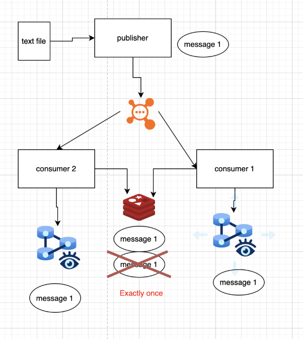

# Redis + RabbitMQ: Кэширование и Exactly Once Processing

## Как используется Redis?

- **Ключи**: `message:{message_id}` (например, `message:abc123`).
- **Данные**:
  - Статус обработки (`"processed"`) или результат в JSON.
  - TTL = 24 часа (удаление старых записей).

## Решение проблемы повторной обработки

1. **Блокировки**:
   - Consumers используют `SET lock:{message_id} 1 NX EX 30` для избежания гонки.
2. **Идемпотентность**:
   - Сообщения содержат `idempotency_key`, который проверяется в Redis.

## Eviction Policy

- `volatile-ttl` – автоматическое удаление ключей с истёкшим TTL.

## Сценарии сбоя

- **При перезапуске Redis**:
  - Данные восстанавливаются из БД при первом обращении к сообщению.
- **При потере данных**:
  - Система продолжает работать, но возможна повторная обработка старых сообщений.

### 📌 **Как запустить проект**

1. **Клонирование репозитория:**

   ```sh
   git clone https://github.com/danula-ded/pub-sub_RabbitMQ.git
   cd pub-sub_RabbitMQ
   ```

2. **Запуск через Docker Compose:**

   ```sh
   docker-compose up --build
   ```

3. **Проверка работы:**

   - **Очередь RabbitMQ**: открой `http://localhost:15672/`, логин/пароль — `guest/guest`. Перейди в раздел **Queues**, найди `messages_queue` и посмотри сообщения.
   - **Был создан exchange**: его можно увидеть во вкладке **exchange**
   - **База данных PostgreSQL**: подключись к контейнеру и проверь таблицы:
     ```sh
     docker exec -it postgres psql -U postgres -d messages_db
     SELECT * FROM message1;
     SELECT * FROM message2;
     ```
     если не работает, нужно открыть программу для администрирования БД, и вбить следующие параметры POSTGRES_USER: postgres - POSTGRES_PASSWORD: postgres - POSTGRES_DB: messages_db

4. **Пересобрать input.txt:**
   ```
   cd .\producer\
   node generate_input.js
   ```

### 🔍 **Как работает система?**

**Producer** отправляет сообщения в очередь `messages_queue` RabbitMQ. **Consumer-1** и **Consumer-2** одновременно считывают их: первый записывает в `message1`, второй в `message2`. RabbitMQ балансирует сообщения между ними, так что они распределяются случайным образом.

## Техническое Задание №1

**Задача: Настройка Pub/Sub в RabbitMQ**

**Цель:**
Настроить систему Pub/Sub с использованием RabbitMQ, где один Publisher отправляет сообщения из файла, а два Consumers получают эти сообщения и записывают их в отдельные файлы.

ЯП - любой

**Шаги реализации:**

1. **Publisher:**
   1. Читает построчно текст из заранее подготовленного файла (input.txt).
   1. Отправляет каждую строку как сообщение в очередь RabbitMQ.
1. **Consumers:**
   1. Два отдельных Consumers подписываются на очередь RabbitMQ.
   1. Каждый Consumer записывает полученные сообщения в базу в отдельную таблицу (название таблиц любое). Либо если опыта с базами не было то у каждого Consumer свой текстовый файл.
1. **Docker Compose:**
   1. Создать docker-compose.yml, который включает:
      1. Сервис RabbitMQ.
      1. Сервис Publisher.
      1. Два сервиса Consumers.
   1. В ином случае подробная документация по запуску проекта

Дополнительный балл:

1\. В качестве бд использована ApacheCassandra

2\. Настроен НЕ дефолтный  exchange в  Rabbit

Отправка решения:

1\. Ссылка на репозиторий в GitHub

2\. Худший вариант - отправка  архива или иной вариант, который можно обсудить лично, либо напишите в тг

## Техническое задание №2

**Использование Redis как in-memory-хранилища и кэша в системе с RabbitMQ**

Показать, как можно использовать Redis для временного хранения данных и кэширования в распределенной системе с RabbitMQ, повышая производительность и устойчивость системы. (Вместо Redis, можно взять: Apache Ignite или Memcached)

**Основная идея:**

- **Publisher** по-прежнему публикует сообщения в RabbitMQ.
- **Consumers** при получении сообщения:
  - Сначала проверяют, нет ли уже обработанного результата или промежуточных данных в Redis.
  - Если в Redis нет — берет сообщение, обрабатывают его, записывает в БД и кэшируют результат в Redis.
  - Если в Redis есть (например, такое сообщение уже обрабатывалось другим Consumer’ом), то записывают в БД и не делают повторную запись.

### **Что нужно продумать:**

1. **Стратегию хранения данных в Redis:**

- Какие ключи и структуры использовать?
- Что будет храниться: результат обработки сообщения, флаг о том, что сообщение уже обработано, или временный статус? (можно свой вариант)
- Продумать и реализовать Eviction policy или TTL

1. **Проблему "гонки":**

- Если два Consumers одновременно обрабатывают одно сообщение, как избежать **дублирования**? (проблема exactly onсe)

### **В README Вы должны описать:**

- Как используется Redis (что хранится, каков формат ключей и тд)
- Как Вы решаете проблему с повторной обработкой сообщений в Redis
- Какая Eviction policy выбрана или как реализован TTL и почему
- Сценарии сбоя: что происходит, если Redis перезапущен или очищен (можно продумать синхронизацию с базой)
- Как вы решили проблему гонки

Абстрактная схема итогового сервиса:


